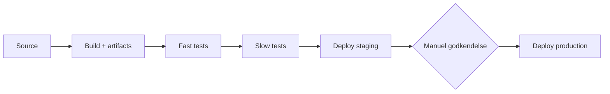

# CI/CD-pipeline for eShopOnWeb

Pipelinen er én GitHub Actions workflow (`.github/workflows/ci-cd.yml`), der bygger, tester og deployer monolittens Web-app. Den kører ved hvert push og pull request mod `main`. Pull requests kører kun build og tests; deploy sker kun fra `main`.

## Stages

| Stage | Job | Hvad sker der |
|---|---|---|
| Source | `build` (første step) | Koden hentes med `actions/checkout` |
| Build | `build` | `dotnet restore` (dependencies), `dotnet build` (kompilering), `dotnet publish` |
| Artifact creation | `build` | Publish-output pakkes som zip og som Docker image, der pushes til GitHub Container Registry |
| Fast tests | `fast-tests` | Unit tests. Test-steppet har `timeout-minutes: 2`, så det fejler, hvis det tager mere end 2 minutter |
| Slow tests | `slow-tests` | Integration tests (`IntegrationTests`, `FunctionalTests`, `PublicApiIntegrationTests`) og API tests, hvor det byggede image startes, og endpoints kaldes med `curl` |
| Staging | `deploy-staging` | Imaget deployes til staging på Render |
| Production | `deploy-production` | Samme image deployes til production efter manuel godkendelse |

## Build once, deploy everywhere

Koden kompileres kun én gang, i build-jobbet. Docker-imaget bygges af det allerede publicerede output (`Dockerfile.ci` kopierer bare filerne ind), så der sker ingen ny kompilering.

Imaget identificeres derefter af sit **digest**, et unikt fingeraftryk af indholdet (`ghcr.io/...@sha256:...`). Build-jobbet sender dette digest videre, og slow tests, staging og production bruger alle præcis det samme. Det, der er testet, er dermed bit for bit det, der kører i production.

## Miljøspecifik konfiguration

Imaget indeholder ingen miljøspecifikke indstillinger. De ligger to steder uden for artefaktet:

**GitHub environments** (`staging` og `production`) indeholder det, pipelinen skal bruge for at deploye. Det er secret `RENDER_DEPLOY_HOOK`, som peger på det rigtige miljø, og variablen `APP_URL`. Pipelinen bruger samme navn i begge jobs, og GitHub vælger værdien ud fra environmentet.

**Render** indeholder appens egne miljøvariabler, sat pr. service i Render-dashboardet. Eksempel:

| Variabel | Staging | Production |
|---|---|---|
| `ASPNETCORE_ENVIRONMENT` | `Docker` | `Docker` |
| `UseOnlyInMemoryDatabase` | `true` | `true` |
| `PORT` | `8080` | `8080` |
| `baseUrls__webBase` | staging-URL | production-URL |

ASP.NET Core læser miljøvariabler oven på `appsettings.json`, så de overskriver standardværdierne uden at imaget ændres. `ASPNETCORE_ENVIRONMENT=Docker` bruges, fordi eShopOnWebs `Program.cs` i "Production" forventer Azure Key Vault. Det er værd at tjekke i jeres egen `Program.cs`.

## Failure notifications

GitHub sender som standard en e-mail, når en workflow du har startet fejler; det kan justeres under GitHub **Settings → Notifications → Actions**. Derudover sender jobbet `notify-failure` en Discord-besked med link til den fejlede kørsel, hvis secret `DISCORD_WEBHOOK_URL` er sat. Mangler secret'en, springes steppet bare over.

## Manuel godkendelse

Godkendelse er ikke en del af YAML-filen, men en indstilling på GitHub environment `production`: **Required reviewers**. Når pipelinen når `deploy-production`, pauser den og venter, til en reviewer trykker "Approve" i GitHub. Du kan selv være reviewer, så længe "Prevent self-review" ikke er slået til.

**Vigtigt:** Required reviewers virker kun på **public repositories** med GitHub Free, Pro og Team. På private repositories kræver det GitHub Enterprise. Gør derfor repoet public.

## Opsætning (engangsopgave)

1. **Gør repoet public** (Settings → General → Danger Zone). Det er nødvendigt for manuel godkendelse og gør det nemt for Render at hente imaget.
2. **Kør pipelinen én gang** (push til `main`). Build-jobbet opretter pakken `eshop-web` under dit GitHub-profil → Packages. Deploy-jobbene fejler første gang, fordi der endnu ikke er noget at deploye til; det er forventet. Tjek, at pakken er **public** (Package settings → Change visibility).
3. **Opret to web services på Render** (render.com, gratis plan): New → Web Service → Existing Image, med image-URL `ghcr.io/<dit-brugernavn-med-små-bogstaver>/eshop-web:<commit-sha>` fra første kørsel. Kald dem fx `eshop-staging` og `eshop-production`, og sæt miljøvariablerne fra tabellen ovenfor.
4. **Kopiér deploy hook URL** fra hver service (Settings → Deploy Hook).
5. **Opret GitHub environments** (repo Settings → Environments):
   - `staging`: secret `RENDER_DEPLOY_HOOK` = staging-hook, variabel `APP_URL` = staging-URL.
   - `production`: secret `RENDER_DEPLOY_HOOK` = production-hook, variabel `APP_URL` = production-URL. Slå **Required reviewers** til, og tilføj dig selv.
6. **Discord (valgfrit):** Server Settings → Integrations → Webhooks → New Webhook → Copy URL. Gem som repository secret `DISCORD_WEBHOOK_URL`.
7. Push en ændring, og følg pipelinen under fanen **Actions**.

Render's gratis plan lukker appen ned efter inaktivitet, så første kald efter en pause kan tage op mod et minut.

## Perspektivering

Pipelinen er bevidst holdt minimal. Følgende er fravalgt, men ville være relevant i et større eller længerevarende projekt:

- **Hemmeligheder i en vault** (fx Azure Key Vault) i stedet for miljøvariabler, når der kommer en rigtig database med connection strings.
- **Smoke test efter deploy**, så pipelinen selv verificerer, at staging og production svarer, og **automatisk rollback**, hvis de ikke gør.
- **Én genbrugelig workflow pr. microservice** (`workflow_call`). Når monolitten skæres op med strangler pattern, får hver service sin egen pipeline og kan deployes uafhængigt. En reverse proxy (fx YARP) foran systemet flytter trafikken gradvist fra monolitten til de nye services.
- **Promotion-tags** (`staging`, `production`) på imaget, så man i registryet kan se, hvad der kører hvor, samt en manuel rollback-workflow.
- **Caching af NuGet-pakker** for hurtigere builds, **code coverage** med minimumskrav og **sikkerhedsscanning** af imaget (fx Trivy).
- **Supply chain security**: signerede build-attestations og actions pinnet til commit-SHA.
